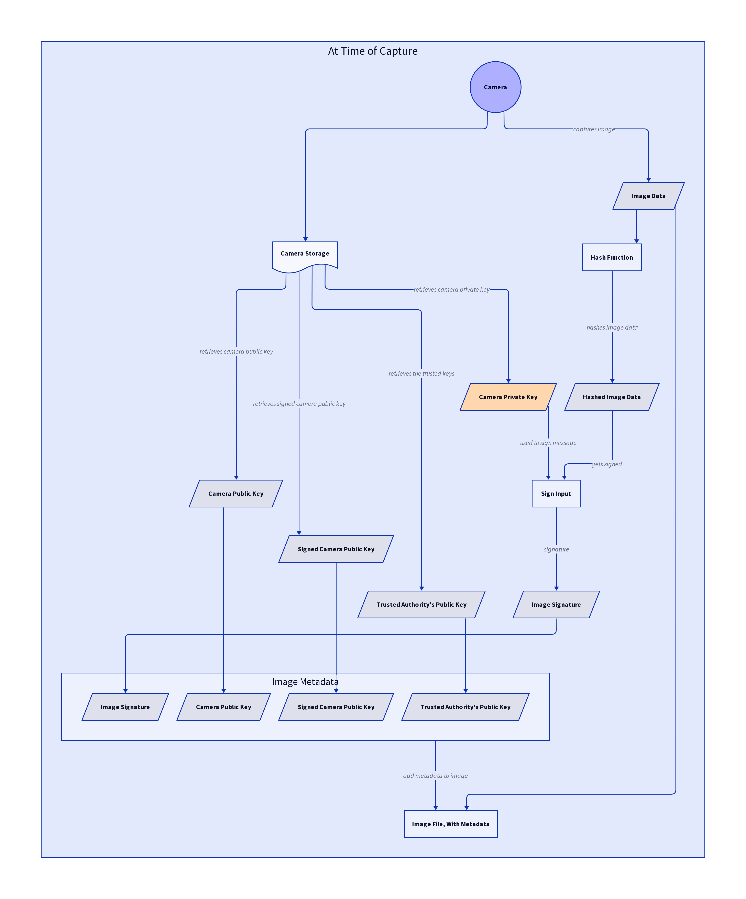

# How See3 Works

Achieving provably-real images required a way to verify the origin of images without exposing the photographer’s identity. However, existing techniques weren’t privacy-preserving, couldn’t scale, or lacked essential features needed for moderation.

We created cryptographic descriptors to fill this gap.

## How Does This Work?

Metadata is crucial for establishing trust online, but features no cryptographic protection by default. Digital signatures are often employed to ensure the correctness and origin of this metadata; without them, it would be easy to forge or alter the information. However, digital signatures require you to know and trust the author's public identity (key), which isn't always practical or desirable, especially when privacy is a concern.

Cryptographic descriptors address these issues by redefining how metadata is authenticated. Instead of relying on individual authors to generate and sign the metadata, trust is placed in a central authority that verifies the information (metadata) associated with data's origin and creates a reusable descriptor for it. This metadata can contain a person's name and age, the serial number of a device, or anything else — it's possible for the data to have a non-human origin.

When someone requests a descriptor, they suggest exactly what their metadata should contain and provide evidence that this information is correct to the central authority. The authority then evaluates this information to decide whether to issue a descriptor and what content it should reference. This process is entirely programmable, enabling you to easily adapt cryptographic descriptors for any context.

Authors have the freedom to disclose parts of their metadata and hide others when certifying their data — only necessary information is shared. This enables verifiers to authenticate the data using valid, centrally-approved metadata without deanonymizing the author. This allows, for instance, a freelancer to reveal their verified qualifications to a client without exposing their name.

## Ensuring The Devices Only Submit Real Images

When an image features a See3 Cryptographic Descriptor, the user can be sure of the following:

- The image was captured using an approved application on a verified device.
- The approved application confirms the image is real.
- The image has not been altered since it was taken.

Application developers that implement the See3 SDK will issue cryptographic descriptors only to verified devices running an authentic copy of their application. These devices use secure hardware environments to protect cryptographic information, ensuring that only verified code can bind descriptors to images.

This relies on the honesty of the application developer, as well as the ability for Android and iOS devices to perform *remote attestation*. Remote Attestation enables the application developer to know know that the image was captured using an approved application on a verified device. This is made possible by the device's secure enclave, which can produce signed cryptographic reports which testify to the state of the device.

## Balancing Privacy With Accountability

Cryptographic descriptors offer indistinguishability. This means that, even with multiple examples certified by some cryptographic descriptor, there's no way to tell which ones came from the same descriptor and which didn't. This level of anonymity surpasses pseudonyms such as public keys, ensuring users can remain truly anonymous if they choose to.

Yet, cryptographic descriptors also address the need for holding malicious parties accountable. In situations where it's necessary — for example, for regulatory compliance — a majority of trusted moderators can work together to reveal the descriptor's unique identifier, needing only a single example of falsely certified data.

If misuse is detected, such as a hacked device using Realcaster to post misleading images, the trusted moderators will recover the descriptor's identifier and use it to revoke the descriptor. This renders the cryptographic descriptor invalid — it can't be used again.

With advanced cryptographic tools, it's even possible to issue cryptographic descriptors without revealing the author's information to the central authority itself. This preserves author privacy during the issuance process, making cryptographic descriptors particularly suitable for applications which require compliance with stringent data-protection regulations.

## How We Maintain Trust And Decentralisation

Establishing corruption-resistance is crucial, especially in sensitive scenarios like whistleblowing. Imagine a whistleblower exposing wrongdoing within their organization — it's vital that their identity remains confidential, even from their own employer. We achieve this by distributing the roles of issuing descriptors, revoking descriptors, and accessing the identities behind them among independent entities.

An employer can operate without the ability to infer the employee's (author's) identity from an example of data, even if they're responsible for issuing and revoking cryptographic descriptors for their employees. Under these circumstances, the connection between the descriptor's usage and the individual's identity remains effectively concealed and the ability to recover the user's identity is delegated to some trusted third party, such as an auditor.

If it's ever necessary to uncover the identity behind a descriptor — such as in cases of criminal investigation or when mandated by a court order — the trusted third party can step in. This neutral entity has the capability to map a used descriptor back to an identity but only under controlled or legally sanctioned circumstances.

Additionally, each entity can employ optional multi-party computation (MPC), which ensures that no single participant has access to sensitive information. Instead, they jointly compute over encrypted data without the ability to inspect its contents. Even if a server is compromised, the system remains secure because critical operations require collaboration.

## The See3 TrustCouncil

The capability to recover the device identifier from an example of an image, as well as the ability to revoke devices from a system, may be implemented using the See3 Impartial Misinformation Committee. This committee will play a crucial role in flagging misleading images and mitigating cyber-attacks which compromise legitimate devices to post fraudulent images. 

By delegating the responsibility of identifying and revoking fraudulent content to an impartial committee, we ensure that accountability is maintained without compromising the privacy of honest users. This approach reconciles the need for effective content moderation with the protection of individual privacy.

We look forward to sharing further details over the coming weeks.

## Scalability

We designed cryptographic descriptors to be efficient and scalable, so they work well even when used on a large scale. Here's what that means:

- **Small Size**: Each descriptor is about 520 bytes when bound to data. This keeps storage and transmission requirements low.
- **Fast Processing**: Creating a signature on data takes about 50 milliseconds, and verifying a descriptor takes around 20 milliseconds. This means operations happen quickly, without noticeable delays.
- **Quick Issuance**: Descriptors can be issued in less than a second, making them practical for real-time applications.
- **Efficient Revocation**: The system can handle up to 10,000 revocations per second. This ensures that updates to the list of invalid descriptors happen promptly.

## It Works Offline

Cryptographic descriptors are built to function effectively both online and offline. In an online context, verifiers can quickly check the status of descriptors, ensuring they haven't been revoked. In offline scenarios, verifiers can still trust the validity of descriptors based on the last known status, thanks to timestamps included within the descriptors.

The timestamp indicates when the descriptor was last updated, providing assurance that the author was in good standing at that time. Once connectivity is restored, any updates — including revocations — can be processed to maintain overall system integrity.

## The Underlying Cryptography

Cryptographic descriptors are implemented using a variant of anonymous credentials called BBS, in tandem with a cryptographic accumulator.

We look forward to offering mathematical details soon!

---

::: warning Important Note

We've recently revamped the way that See3 works to use our in-house Cryptographic Descriptors. They're instantaneous, feature improved privacy, and are far more flexible.

This part of the article reflects the way that See3 worked in the past. We'll update the article shortly to reflect the recent changes.

:::

## The Trust Model

The following describes the trust model for most hardware-attested content schemes, including our own.

**Q: Can You Explain The Diagram?**

- The **Trusted Authority (Camera Manufacturer)** certifies the camera's key-pair, establishing the camera as a trusted device for capturing images.

- The **Camera** captures **Images**, then signs them. This signature implies that the image is authentic, since trusted cameras only sign what they see.

- The **User (Verifier)** trusts the Trusted Authority, laying the foundation for a trust chain that extends from the authority, through the camera, and to the images it captures.

- By verifying the links in the chain of trust, all of which are secured by cryptographic signatures, the **User (Verifier)** can trust the **Image**.

**Q: Why Should The User Trust The Authority?**

Users should trust the authority, typically represented by camera manufacturers, for several interconnected reasons, all grounded in the structured mechanisms of the See3 ecosystem:

1. **Community Endorsement:** The authority's admission to the See3 Trust List is not arbitrary but is the result of a democratic voting process by the community of See3 token holders. This means the manufacturer's inclusion signifies a collective endorsement from an informed community, attesting to the manufacturer's credibility and the security of their devices.

2. **Economic Incentives and Penalties:** The See3 Arbitration Contract introduces significant economic incentives for manufacturers to maintain the highest security standards. Manufacturers are required to deposit USDC into the Arbitration Contract as a form of security, which can be partially or wholly slashed if their cameras are found to be compromised frequently. This financial stake motivates manufacturers to invest in advanced security measures and ensures they are directly accountable for the integrity of their products.

3. **Reputation and Track Record:** Beyond the immediate mechanisms of See3, the reputation and historical performance of a manufacturer play essential roles. A manufacturer with a long-standing reputation for quality and security is likely to maintain these standards to protect their market position. The track record of producing secure, reliable cameras serves as a tangible indicator of their commitment to upholding the ecosystem's integrity.

**Q: Why Should The Authority Trust The Camera?**

The authority can trust the camera based on the security of the hardware and the rigorous testing it undergoes at the time of manufacture. Secure hardware is designed with tamper-proof and non-cloneable elements, ensuring that the camera's identity and the authenticity of its signatures can be trusted. These security measures are embedded into the hardware at a fundamental level, making it extremely difficult for unauthorized parties to manipulate or forge the camera's outputs. Through this process, the authority establishes a high degree of confidence in the camera's ability to function as a trusted device for capturing authentic content.

**Q: How Do You Implement This Trust Model?**

We will _gradually_ introduce our scheme, starting with a simple signature-only design. Whenever we introduce an approach, we will offer criticisms and potential points of improvement, before moving on to the next iteration. Through this process, we will arrive a comprehensive understanding of See3's architecture, such that the trade-offs and design choices have been carefully justified through the process of iteration.

## Attempt One: Signature-Based Attestation (ie, C2PA's Implicit Attestation)

### Camera Certification

This step is necessary to establish the camera is authentic (thus honest). It involves the generation of a key-pair on the camera's secure enclave, and the signing of the camera's public key by the trusted authority. It is a necessary set-up step, producing information that will be used later for proving that images are real.

**Key: The orange data never leaves the camera's secure enclave.**

#### Simplified Explanation

1. The capture device (camera) generates a key-pair on its secure enclave, when it is set-up. Cameras with native hardware-attestation will have this process done in the manufacturing plant, otherwise the keys will be generated and sent over the internet with some form of encryption and authenticity proof.
2. The trusted party, such as the camera manufacturer, will certify the capture device by signing the camera's public key with their own trusted authority private key, thereby producing a *Camera Public Key Signature*. This signature is analogous to stamp-of-approval from the trusted authority, promising that the capture device is honest and will not submit deepfakes.
3. The capture device will store this signature, alongside its own key-pair, in secure storage. This information will be used later to prove the authenticity of images.

### Signing

This is the process of producing a cryptographic proof that an image captured by the honest camera is real, which is equivalent to proving that the image comes from an honest camera that will refuse to cryptographically sign a deepfake.

**Key: The orange data never leaves the camera's secure enclave.**

#### Simplified Explanation

1. The camera cryptographically signs the image that it captures, using its own private key, producing an *image signature*.
2. The camera's signature is included in the image metadata, alongside the camera's public key.
3. We also include the signature from the trusted authority, which is used to verify that the camera that took the picture is honest, within the metadata of the image.
4. The metadata now contains a complete cryptographic trust chain, tying the authenticity of the image to the credibility of the trusted authority.

### Verifying

#### Step-By-Step Explanation

1. The verifier will read the image metadata.
2. The user's device will verify the validity of the camera's public key by comparing the Camera Public Key Signature against the Trusted Authority Public Key.
3. The verifier checks whether it trusts the Trusted Authority Public Key by checking its *Trust List*. If it is on the trust list, the user's device will trust whatever images are signed by that Camera Public Key.
4. The user's device will verify the authenticity of the image by checking the image signature against the camera's public key, and will trust that the image came from the camera that it claims to be.
5. If both verifications are successful, the user's device will trust the image.

### Limitations

It is impossible to verify the trust chain without revealing the camera's public key -- otherwise, the necessary signature verification is impossible. However, if we reveal the camera's public key, it will appear on every image the camera produces. Since the key will be unique to the camera, it will be possible to associate images which originate from the same camera with each-other by merely checking that the Camera Public Key of each are the same. This is awful for user privacy.

## Attempt Two: ZK-Anonymised Attestation

Let's start with an image which is attested with a signature chain. We need to conceal the camera signatures and public keys, to avoid the privacy vulnerability described previously. We'll extend the previous scheme with zero-knowledge cryptography, but the Signing and Camera Certification step will remain the same.

### Proving

**The yellow inputs are _private_ inputs. Therefore, they are only known to the prover (the camera).**

#### Step-By-Step Explanation

1. You perform the Signing step as before, thereby producing a cryptographic chain of trust.
2. You use ZK circuit to prove that the Camera Attestation produced during the signing step is real. It's the same as how we verified the image before, except we're using executing the code within a ZK context this time.
3. If the data can successfully be verified, executing the ZK circuit will result in a verifiable ZK proof of the authenticity of the image.
4. The ZK proof is a cryptographic proof that the chain-of-trust that authenticates the image is real and valid. It's practically equivalent to cryptographic chain that we got before, except it doesn't give away what the camera's public key is.

### Verifying

#### Simplified Explanation

1. The verifier will read the image metadata.
2. As before, the verifier checks whether it trusts the Trusted Authority Public Key by checking its *Trust List*. If it is not, then the verifier will not trust the image.
3. The verifier will check the validity of the ZK proof attached in the metadata, by comparing the ZK proof against the Trusted Authority Public Key.
4. If the ZK proof is valid, the verifier will trust the image.
4. Since it is impossible for the ZK proof to be valid if there is no signature chain which corresponds to the image and the trusted authority, the user can rest assured that the image comes from an honest camera, without ever knowing the camera's public key.

### Limitations

Now that the image public key is gone, we have no way of blacklisting hacked cameras. This undermines all cameras that use this scheme, since they can still generate valid proofs for any image, therefore undermining trust in the proofs.

For these reasons, it is desirable to add an encrypted form of the camera's public key to the metadata. This would enable us to add a camera's public key to the blacklist if it misbehaves, and to check whether the camera used to generate a given photo proof is on the blacklist. Ideally, this encrypted version should not be decryptable by malicious actors, ensuring that there is no way to de-anonymise the camera user. 

The next section describes a modified version of this scheme, which introduces encrypted camera identifiers.

## ZK-Anonymised Attestation with Encrypted Camera Identifiers (See3)

### Proving

**The yellow inputs are _private_ inputs. Therefore, they are only known to the prover (the camera).**

#### Simplified Explanation

1. We do exactly what we did last time, except this time we use a one-time encryption key to generate an encrypted version of the Camera Public Key, which can only be decrypted by the keeper, and we include this in the metadata alongside the Encrypted Camera Identifier also.
2. We encrypt the Camera Public Key to produce the Encrypted Camera Identifier using a secret key which is generated by combining a randomly-generated, called the ECDH Key, with the ECDH Public Key of the Keeper, in a process called Scalar Multiplication. The resulting key is called the Shared Secret.
    - The point of creating a shared secret is to let the Keeper know what secret key to use for decrypting the encrypted version of the Camera Public Key.
    - We can't attach it to the image data, since everyone would see it, so we need a way of letting the keeper calculate this decryption key in such a way that only they can figure it out.
    - This process is called ECDH, and it too much for us to explain here. 
3. We also generate a ECDH Public Key of our own, which the Keeper will need to generate the Shared Secret, so that we don't have to reveal the Shared Secret. This will be attached to the image.
4. We make sure to do this in the ZK circuit, and verify from inside the ZK circuit that the user has correctly generated the Shared Secret and ECDH Public Key. This prevents malicious actors from sabotaging the Encrypted Camera Identifier, making it impossible to decrypt and thus preventing malicious capture devices (cameras) from being blacklisted.
5. We have to specify the Keeper Public Key to this ZK Circuit.

### Verifying

#### Step-By-Step Explanation

1. It's exactly the same as before, except you're checking the ECDH Public Key, Keeper Public Key and Encrypted Camera identifier against the ZKP also.

### Blacklist Operations

Remember, the Keeper is not a singular entity, but rather a network of keeper nodes working together through Multi-Party Computation to maintain the shared, secret blacklist.

#### Querying Blacklist

The above diagram demonstrates how a user will communicate with the keeper to verify that the camera used to taken a given image is not on the blacklist. 

The following describes the process of querying the blacklist from the keeper's perspective.

#### Adding to The Blacklist

This process is only triggered when an image has been identified as fake through the arbitration process. The "Entry to Blacklist" is retrieved from the image metadata, just as the Query to Blacklist is retrieved in the previous section. 

## Implementation Specifics

If you're looking for specific hash functions, data structures, cryptographic techniques, and other details which are necessary to create a See3-compatible software implementation, please see our [Specification.](../Specification/Specification.md)

